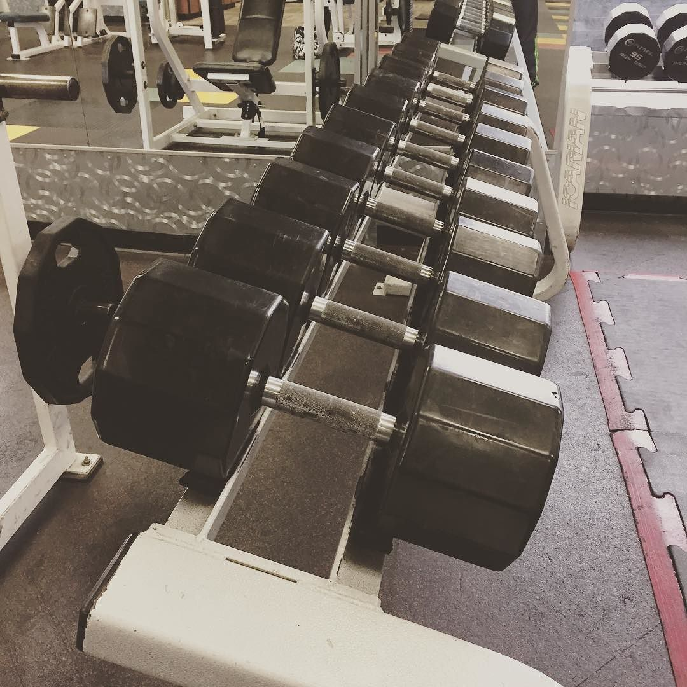

A few years ago I would consider myself a person who likes to do things in a batch by focusing on one thing and see it through completion. For example, implementing a feature in an app.

However, there are certain tasks which you simply cannot finish in a few days, like writing a book, building strength in your body or learning a new language. It's better to turn the work on those things into habits. Just do a little bit every day.

I found that instead of results which are often fluctuate in time (e.g., writing 500 words everyday), it's better to block time, let's say one hour on my new book and 30 minutes on learning Spanish **everyday, even weekends and vacations**.  After a few days those activities becomes not very dissimilar to brushing your teeth.

You can accomplish a lot by doing small and simple things every day. I started with doing 10 push-ups and 20 sits up every morning a year ago. Now, I'm on to doing 100 sit ups and 50 push ups effortlessly. Chunk down your large projects and be consistent in the execution!