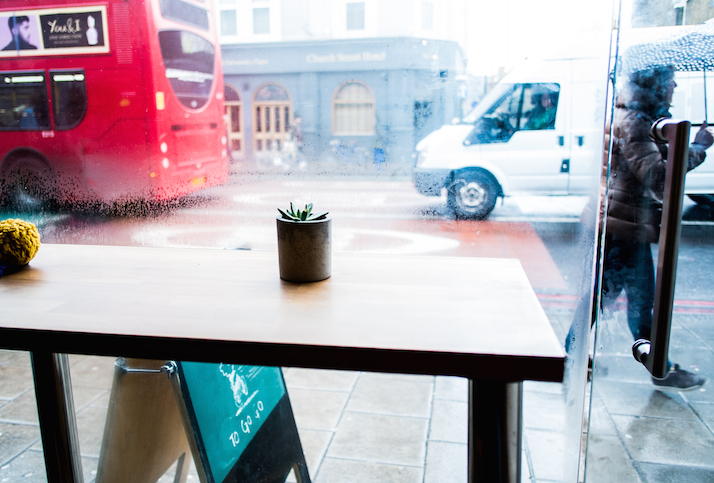

The more I think about happiness, the more I come to the conclusion that it's overrated. Maybe it's even detrimental to actually living a productive and healthy live. You see, evolutionary **humans weren't designed to be happy all the time**. For example, you're having a great day, maybe you made progress on a project, then you have think what would make you happy and boom—the mood goes down if you don't get it.

Happiness is simply not wired into our brains and nervous system by millions of years of evolution. **Humans were designed to survive**, and survival doesn't mean happiness. Survival is at the bottom of the Maslow's pyramid, and it's what our oldest brain is doing perfectly. Why work hard trying to achieve something you're doing sub-optimally?

Lower expectations bring more satisfaction, right? Once I realized that we weren't born to be happy, I had an epiphany which liberated me:

* Forget about this illusive happiness. In the never-ending pursuit of it, you'll remain miserable.
* Stop thinking that you're supposed to be happy all the time. Banish the entitled to feel good or thoughts on how to achieve it.
* Just live in the moment, survive and be productive, instead of worrying about illusive feeling.

Stop pursuing happiness; search meaning in your life instead.