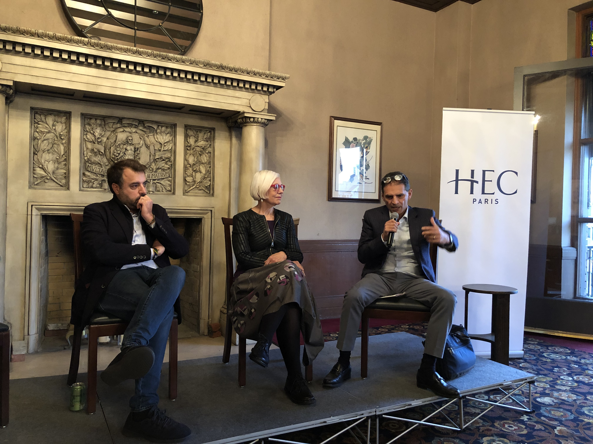
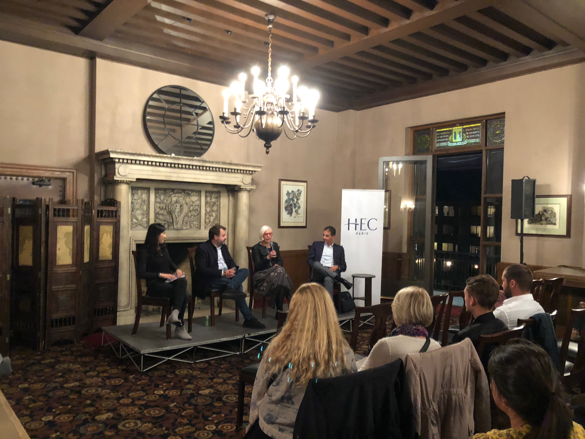
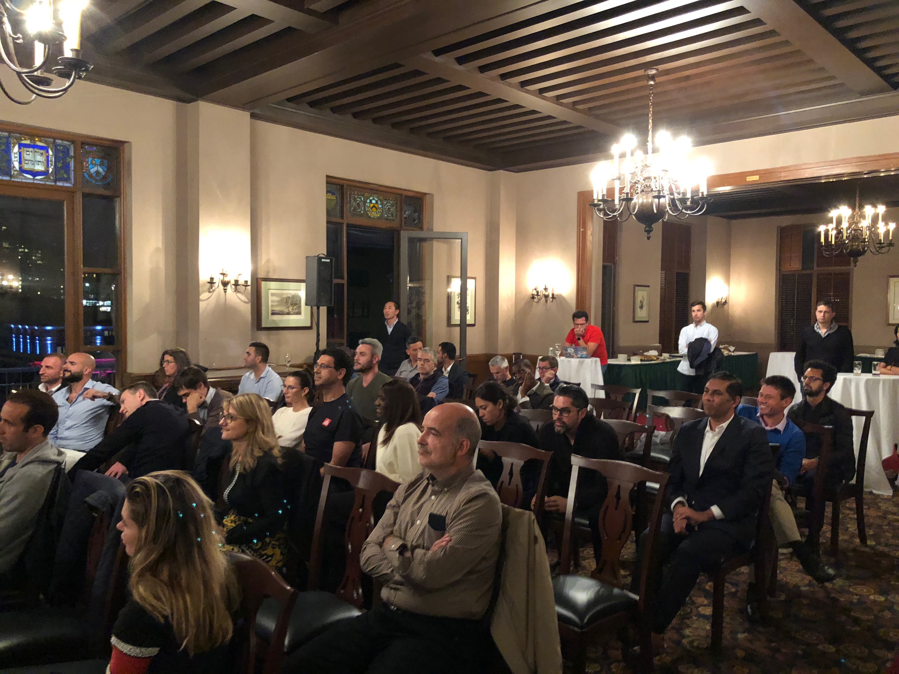

We're halfway done with the phase one of the Master of Science in Innovation and Entrepreneurship program at HEC Paris. This post will summarize two new courses that I've taken and passed: *New Product Development* and *Organizational Design and Management*. The common theme of these two courses is organizing teams and incentivizing them, hence the name of the post.

## New Product Development

The New Product Development course is, as you can get from the name, about developing new products, but those new products don't have to be completely new products. In fact, most of the times when companies develop new products, they are extending their current lines of products, or enhancing existing products. 

In the course we've learned to ask three main questions: Is a real? Can we win it? Is it worth doing? We've learned how to apply the net perceived value or NPV. We've learned about the Stage Gate process, concurrent engineering, the Agile process, the selectionism and parallel trials methods, learning and iteration methods and many more techniques. As you can already see from all the names of the methods, the course has a lot of references and give students good understanding on what is out there and the next steps on where to find them.

When developing new products, there are various types of uncertainties: variation, known risks and unforeseeable uncertainty. In the end, there is no right or wrong solution. It's all about the strategy at a particular company, at a particular time, for a particular line of products and services. Most often, you will not bet on one innovation but work with a portfolio of products and services. Some of them will be short term and some of them long term. This is done to mitigate any risks (just like in a portfolio of stock investments), and to balance between increasing short-term profits and winning big long-term with a disrupting new product or service.

And then of course, we've learned how to organize different teams according to different types of new product developments. For example, using colocation of teams, matrix structure or using functional teams. The main takeaway of this course is **not all new products worth, developing and not all new products are equally exciting and beneficial to the company and the business.**

## Organizational Design and Management

Although, the organizational design and management is a long (and somewhat hard to understand) name for a course, it was fun to watch. This is in part due to the fact that two HEC Paris professors that authored the course were moving from location to location and interviewing different people and they went role playing (e.g., the case of the onion chopping in restaurant in Paris for close). 

As far as the content, the course contained a lot of references to methods and techniques. Also, there were a lot of insights and ideas in this course, including how to identify your competitive advantage or value created, using the business model canvas, or creating an incentive plan for your employees intrinsic and extrinsic motivation.

We looked at Superamas who have a lot of intrinsic motivation for their arts project. We looked at different org structures such as divisional and functional. And lastly, we looked at vertical, horizontal and geographical scaling.

The main takeaway of this course could be summed up as **you don't have to reinvent the wheel, when you're designing your organization and management**. Instead, you can tap into existing patterns experiences frameworks and knowledge.

## HEC Paris Entrepreneurs Panel and Alumni Gathering

I visited a live event in San Francisco, organized by the executive HEC Paris organization. They brought Executive MBA students from Europe (HEC EMBA Entrepreneurship Major Class of 2020), and also they organized an entrepreneurship panel of speakers: Danny Hamadi, Sheryle Bolton, and Carlos Diaz. The event was in an old building next to the famous Fairmont Hotel, where typically USA presidents stay when they visit San Francisco.
 
 
 
We enjoyed networking and splendid city views. Then, we listened to the speakers and had some wine&cheese and more networking. It was interesting to meet with the fellow students from my Master of Science in Innovation and Entrepreneurship program. Also it was insightful to meet with several full-time MBA and Executive MBA students. A lot of the people want to move into the product management roles or start their own companies. That's understandable because typically those are the riskier, and more challenging problem to solve, for which you can also achieve more impact and receive more rewards. 

The HEC Paris community is very strong internationally. There are 300 alumni in the Bay Area, but tens of thousands in Europe and Asia. 

I offered Vincent Murezlle (Executive Director of the HEC USA Representative Office) to host the next visiting class of HEC Paris at my company Indeed in San Francisco and for me to teach a lecture to them. We'll see how it goes. 

 Here are some pics from the event.

