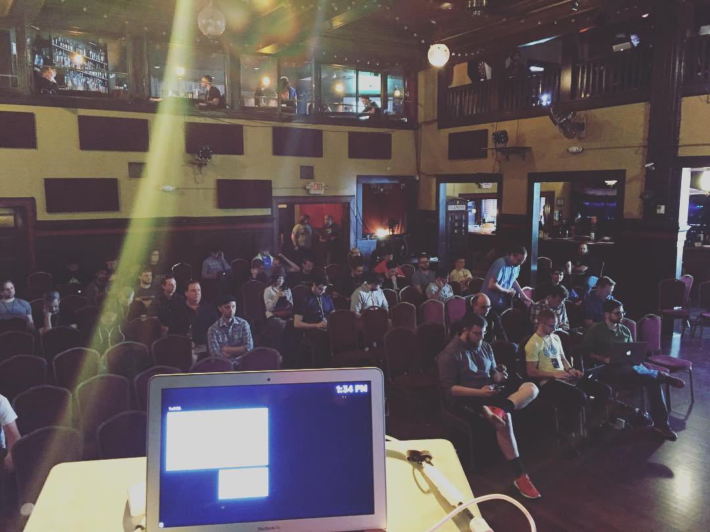

This is a note to myself: the more I can be comfortable being newbie the more I can keep up the pace with current events, tech and apps. The reason being, it's not enough to master one tech or app and assume it won't change.

With the popularity of SaaS and web apps, they are constantly updated without us even asking us! You can forget about an app and comeback to it six month later—it'll could be a **completely** new app. You'll have to learn where all the menus and buttons all over again. Learn to love it. Future apps will update even faster. Same happens with open source and programming languages.

Generally, the more you stay behind the worse the pain of an upgrade later. There is no way around it. Just *embrace being newbie forever, because the faster you learn the more comfortable you'll be in using the recent tech*. **Learning fast is your competitive advantage.**

Obviously, you can't keep re-learning all the things continuously, that's why focusing on a specific area is paramount. Therefore, focus, learn, re-learn and don't afraid to be a newbie because being newbie is and will be our normal state. Being newbie is forever.