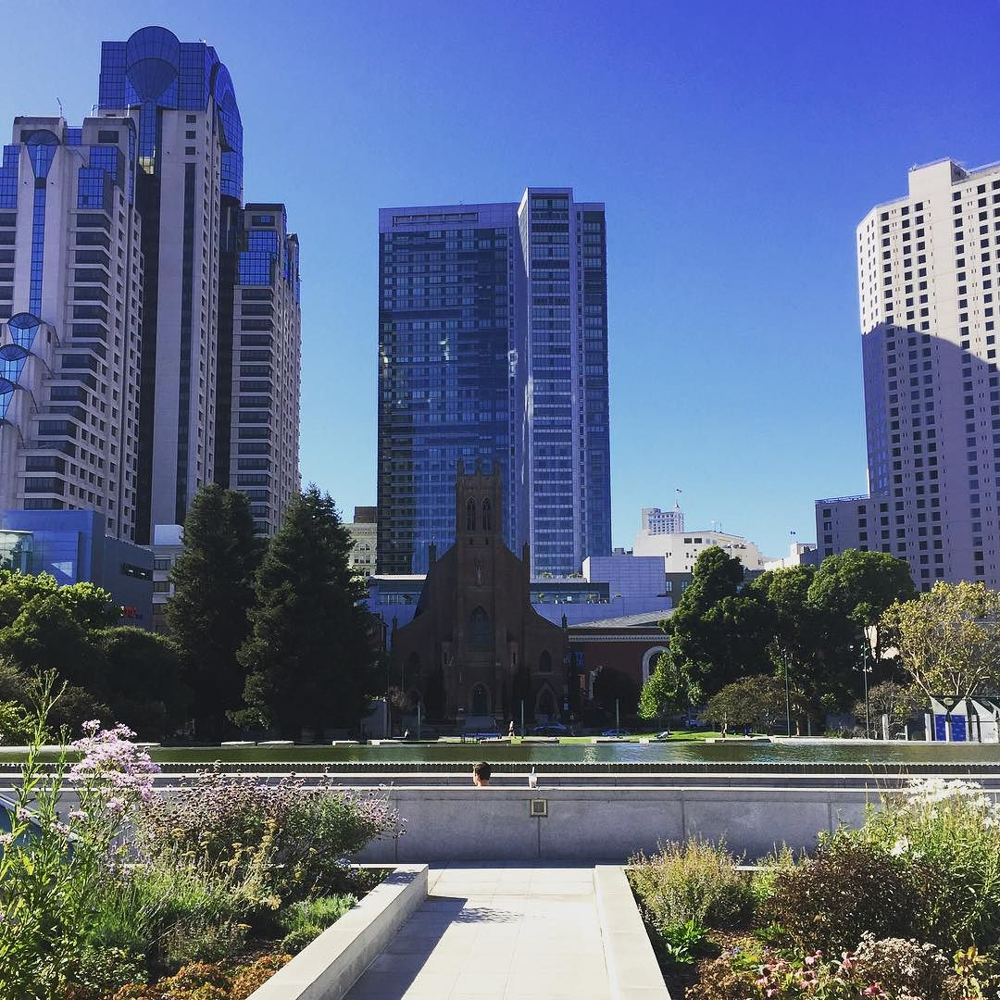

I lived fro 5 years in the Bay Area which is San Francisco, Oakland, San Jose, and everything in between them (a.k.a. Silicon Valley). Before that I lived in Washington DC for 6 year.

Don't confuse tourism with immigration if you've been in the Bay Area on a brief vacation and liked it. Despite what you've seen in movies, San Francisco and Silicon Valley are terrible places to live.

Seriously. Avoid moving to San Francisco and Silicon Valley because:

1. **You will never be able to afford your own place**: Forget about owning your own house unless you're super rich tech millionaire (which you won't become); and large chunk of your pay check will go to the landlord because of the ridiculous laws prohibiting more housing and scaring off owners from renting out.
1. **You will have to work insane hours** in an open-space office filled with extremely loud co-workers and stupid super noisy toys while being assaulted by dogs 🐕 and shot at with nerf guns... needless to say your productivity will be close to 0, and you'll have to catch up after hours and come to work early. Startups had to use the open-office layout because they wanted to save money. Big companies blindly copied it without thinking to "foster" communication and create innovation.
1. **You won't become a millionaire** creating a startup, because your startup will burn through VC money faster than in any other place: Raising money is easy, but spending it on expensive engineers and office is easier. If you manage to partner or hire someone, expect them to leave for greener pastures in 1 year max.
1. **You be SINGLE and lack in true friendship**: Friendship and dating are not just hard, they are almost impossible, because you are surrounded with smart ambitious driven overachiever transplants who can't find time to FaceTime let alone meet (because they are overworked due to poor office environment?); and if you're already married holding on to your spouse will be hard (see 2 and 6)
1. **You will get hot a lot**, because typically there is NO air conditioning in buildings. Yes. it's 2016 and no A/Cs. ☀️ Also, the all-year-round climate with drought will bore and make you long for winter or rain.
1. **You will feel inferior most of the times**: You always be surrounded with people smarter, luckier, more hard-working and more successful people than yourself: If you have a bit of an inferiority complex from time to time, here it will be multiplied by 10
1. **You will start hating driving** because why bother? Streets of San Francisco, 101, I-80, Bay Bridge, any bridge... everything is backed up pretty much all the time. 🚦 Public transportation sucks. It's filthy, slow and full of crazies. This leads to problem number 4 because keeping up with people will be harder.

So give all these points, any reasonable human being who wants to remain sane and productive should avoid San Francisco and the Bay Area and live some where else.

PS: This post has sarcasm, but also has some true points.