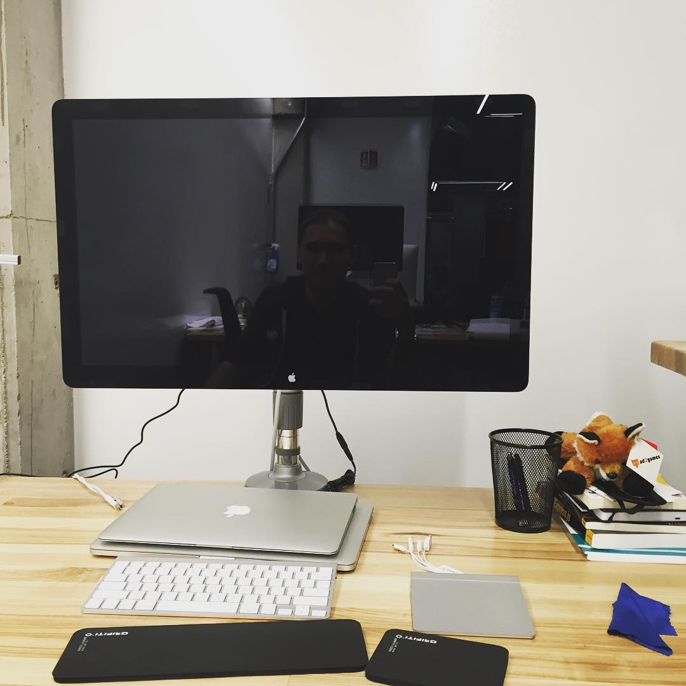

People tend to think that someone is shy just because he/she is not talking to anyone or not going to social events... Although this might be true, I came to the conclusion that there is another reason.

I just want to **do things** instead of talking. While some conversations are insightful. For example, talking with your colleagues or customers is paramount for maintaining good communication. Other social chat is not just boring but mostly a waste of time.

With this in mind, I'm not shy. I'm just biased towards taking action instead of useless talking.